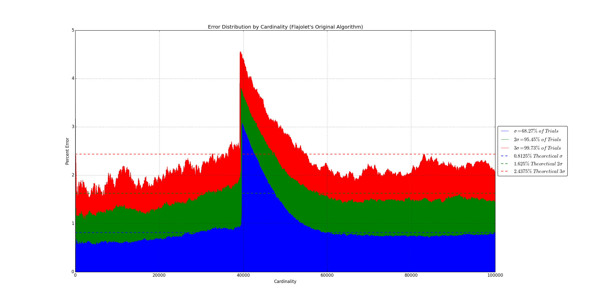
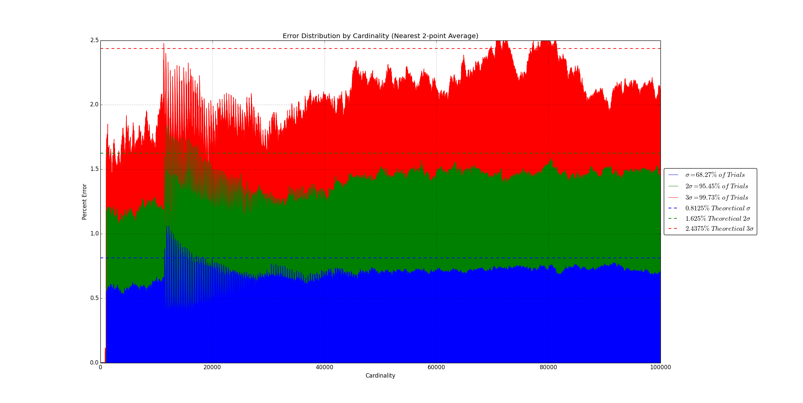
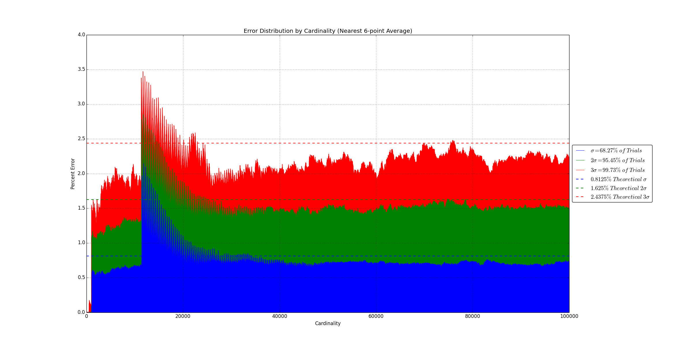
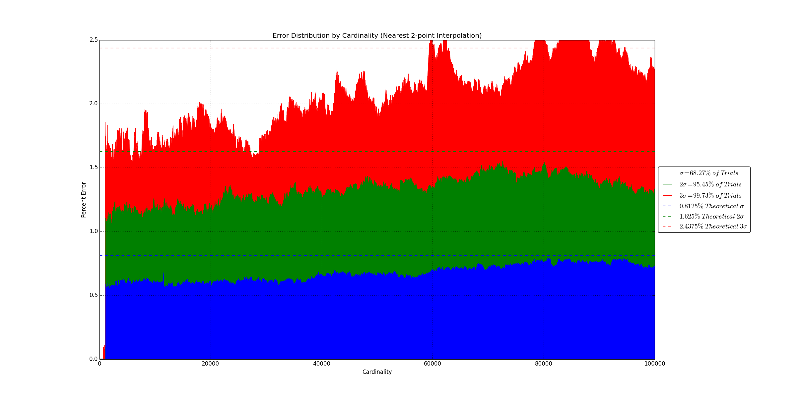
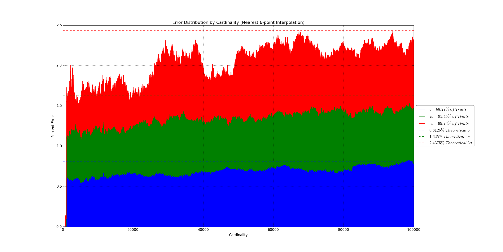

# Design Specifics

The "HyperLogLog in Practice: Algorithmic Engineering of a State of The Art Cardinality Estimation Algorithm", published by Stefan Heulem, Marc Nunkesse and Alexander Hall describes several improvements to the original algorithm created by Flajolet. The improvements focus on correcting and improving the algorithm's performance on lower cardinalities.

I have also made several modifications to help with the amount of space taken when stored to disc by implementing compression on the counters.

For the sake of simplicity assume all estimators are using 2^14 buckets of 6-bits in width.

## Low Cardinality Improvements

### Sparse Encoding
The first improvement is applicable to very low cardinalities. When a counter isn't populated with many entries most of the bins are entirely empty and thus most of the counter is 0's. So instead of storing the rho values in their proper bins store the value `bin_index | rho` in a list until a certain cutoff is reached (discussed in the compression section) where it is deemed no longer beneficial. This also opens up another improvement in accuracy. The concatenation of the bin_index and rho is only 20-bits long (14 + 6) so a large part of this number is 0-bits. To take advantage of this extra space a larger bin_index (25-bits in this case) is used which improves the accuracy of linear counting dramatically. This encoding method is described in greater detail in the "HyperLogLog in Practice" paper.

The improved accuracy can be seen until the counter switches from sparse encoding to dense (at 1020).

### Error Correction
Flajolet's original algorithm actually uses two algorithms depending on the estimated cardinality to provide an estimate. First an estimate is created using the hyperloglog algorithm if this estimate is less than 2.5*number_of_bins (40,960) then a new estimate is computed using the linear counting algorithm. This helps to compensate for the hyperloglog algorithm's over-estimation bias for low cardinalities.

However you can clearly see that a bias still exists when the algorithm switch occurs. It doesn't reach acceptable accuracy until 5*number_of_bins (81,920). This is where some of the improvements described in the "HyperLogLog in Practice" paper are focused. Luckily hyperloglog's bias is very predictable and consistent. Using a list of empircally calculated average errors for ~200 cardinalities in this range much of this bias can be corrected. The error correction is so accurate that it actually becomes beneficial to switch to hyperloglog from linear-counting at a lower cardinality (11,500 instead of 40,960). There are several ways to to use these average errors to correct the bias. The first method tried was simply an average of the two average errors for the the cardinalities closest to the estimate.

This method tends to fluctuate depending on where the estimated cardinality is in relation to nearest average error points. The paper suggests using nearest neighbour for the 6 nearest points (i.e. average of the 6 closest average error points).

This produces better results on higher cardinalities however it performs much worse in the lower cardinalities. So the next attempt was using a linear interpolation of the nearest 2 average error points (i.e. draw a line between them and find where you estimate lies on the line).

This smooths the fluctuations as the cardinality ranges in between average error points. Unfortunately the higher cardinalities are slightly less accurate than the nearest 6 neighbour estimation. So in order to improve on this simple linear regression on the nearest 6 error average points was used.

This produces both good results in the high and low end of the correction range and thus was the final choice for this implementation.

## Compression
